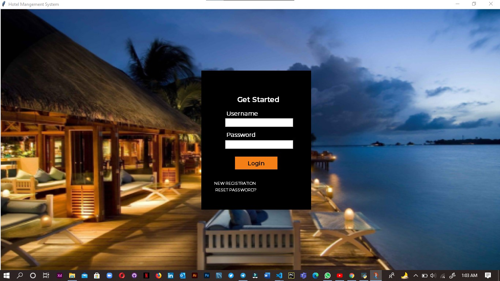
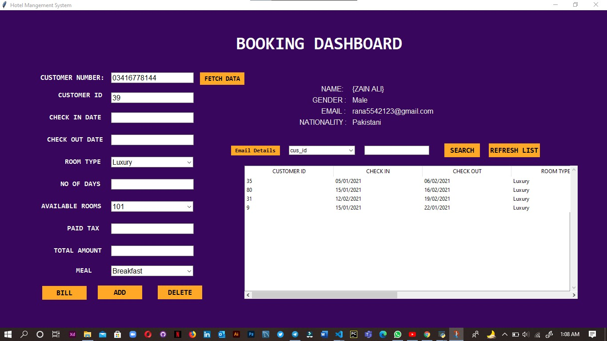

# GUI-PROJECT HOTEL MANAGEMENT SYSTEM PROGRAMMED AND DESIGNED BY ZAIN ALI
This is my first GUI project using python tkinter which display menu of hotel.
<h4 align="center">When a user start his application, He will show his first Window as a Login Page as given bellow. 
<h1 align="center">Login Window 

<h4 align="center">If a new user run this application he has to regiter himself into the system. 
<h2 align="center">New User 

<h4 align="center">In case of forgotten password,the user can reset his password by giving his correct username.When the username provided by the user matched to the database username then a forgot window will be opened which offer user to reset his password! 
<h3 align="center">Reset Password 

<h4 align="center">If user provide correct information,then the system will access the user to the main window of the Hotel Management system. 
In main Window there are five option on the top the dashboard.
 
-Costumer Dasboard
 
-Booking Dashboard
 
-Billing Dashboard
 
-Report an issue Window
 
-Logout 
 
<h2 align="center">Main Window 

When a user Click on the 
<h3 align="center">Costumer Dashboard 

<h3 align="center">Booking Dashboard 

<h3 align="center">Issue Reporting Dashboard 

<h3 align="center">Pop up message on Logout 

<h3 align="center">Pop-up message of Thank You 
<h4 align="center">Pop-up message of Thank You 
